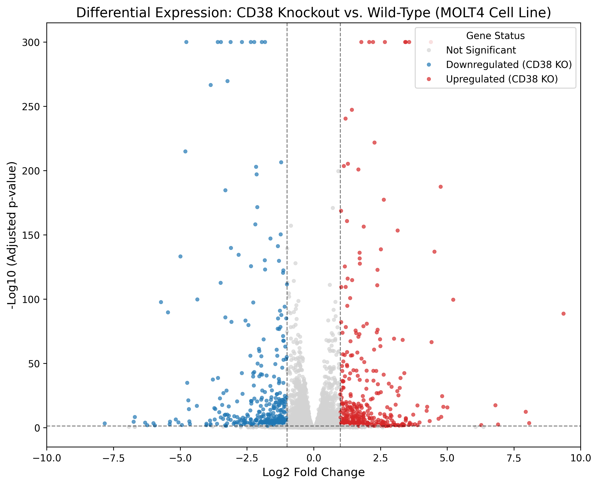

# Differential Expression Analysis: CD38 Knockout in T-ALL Leukemia

## Project Overview
This repository contains an automated, end-to-end bulk RNA-sequencing pipeline analyzing the transcriptomic reprogramming of T-cell acute lymphoblastic leukemia (T-ALL) following the knockout of the CD38 surface glycoprotein. CD38 is a critical target in relapsed pediatric T-ALL, with implications in inflammatory and SRC kinase signaling cascades.

## Computational Workflow
The pipeline was executed within a dedicated Linux WSL Conda environment to ensure strict dependency isolation and reproducibility. 
* **Data Ingestion:** Processed and merged 22 RSEM expected count matrices using `pandas`.
* **Experimental Design:** Constructed a metadata design matrix to isolate the `MOLT4` cell line, mitigating batch effects from patient-derived xenografts.
* **Statistical Modeling:** Conducted rigorous differential expression analysis (Knockout vs. Wild-Type) utilizing `PyDESeq2`.
* **Visualization:** Generated publication-quality Volcano plots via `matplotlib` and `seaborn`.

## Biological Insights


*Figure 1: Volcano plot highlighting statistically significant differential expression (padj < 0.05, |log2FC| > 1). Red indicates significant upregulation following CD38 knockout, while blue indicates downregulation.*

The statistical output isolated distinct downstream regulatory shifts, effectively cutting through transcriptomic noise to pinpoint specific targets (e.g., *DPM1*) affected by the neutralization of CD38.

## Reproducibility
To execute this pipeline locally and reproduce the statistical findings, clone this repository and instantiate the identical computational environment:
```bash
conda env create -f environment.yml
conda activate leukemia_project
jupyter notebook
